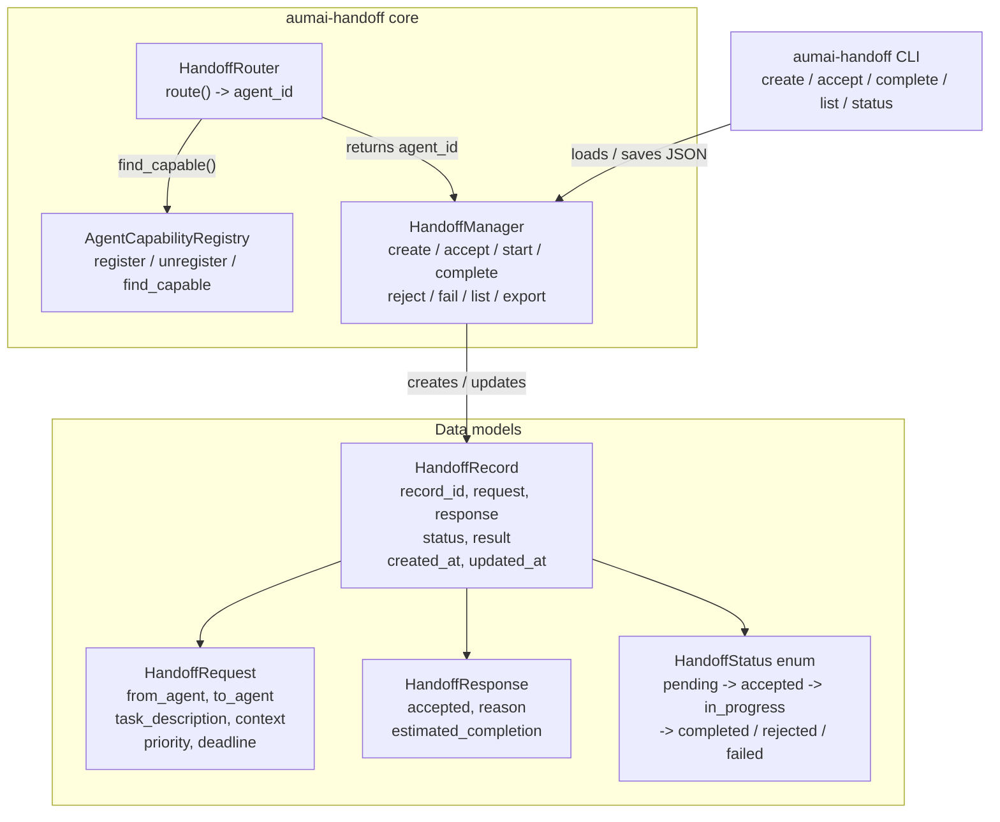

# aumai-handoff

**Standardized agent-to-agent task handoff — with lifecycle tracking, capability routing,
and persistent state.**

[](https://github.com/aumai/aumai-handoff/actions)
[](https://pypi.org/project/aumai-handoff/)
[](LICENSE)
[](https://python.org)

---

## What is this?

Imagine a hospital emergency department. When a patient moves from the ER to the ICU, there
is a formal **handoff** — the ER physician gives a structured briefing to the ICU physician:
the patient's condition, current medications, pending decisions, and urgency level. Nothing
is assumed to be remembered. Nothing is informal. The ICU physician accepts or declines
based on capacity. A paper trail exists for every step.

`aumai-handoff` brings that discipline to **agent-to-agent task transfers**.

When Agent A cannot or should not continue a task, it creates a `HandoffRequest`. A
`HandoffManager` tracks the request through a strict lifecycle: `pending` → `accepted` →
`in_progress` → `completed` (or `rejected` / `failed`). The entire chain is serializable
to JSON and can be persisted to disk and restored later. A `HandoffRouter` can even find
the best agent for the task automatically, based on capability matching.

The result is a **verifiable, auditable record** of every inter-agent task transfer in your
system — whether you are building a two-agent pipeline or a fleet of a hundred.

---

## Why does this matter?

In production multi-agent systems, the handoff moment is the riskiest. It is when context
gets lost, when accountability blurs, when tasks silently vanish. Common failure modes:

- Agent A finishes its part and passes output to Agent B with no acknowledgement mechanism — if B is down, the task is gone.
- No priority signal — B processes A's critical task after a backlog of low-priority work.
- No record of who handled what — debugging requires log archaeology.
- Capability mismatch — A routes to B because it is "available", but B lacks the skills.

`aumai-handoff` addresses all of these with a small, focused library:
- **Structured requests** with priority (1-10), deadline, and arbitrary context payload
- **Explicit lifecycle transitions** that raise errors on invalid state changes
- **Capability-based routing** that matches tasks to agents by what they can actually do
- **Persistent JSON store** so the handoff log survives process restarts

---

## Architecture



### Component responsibilities

| Component | Responsibility |
|---|---|
| `HandoffManager` | Creates and manages the lifecycle of `HandoffRecord` objects in memory; exports/imports JSON |
| `AgentCapabilityRegistry` | Tracks which agents have which capabilities; answers "who can do X?" |
| `HandoffRouter` | Selects the best agent for a request by matching capabilities or falling back to any available agent |
| `HandoffRequest` | Immutable specification of a task to hand off, with priority and deadline |
| `HandoffResponse` | The receiving agent's accept/reject decision with an optional reason |
| `HandoffRecord` | Full audit trail for a single handoff: request, response, status transitions, timestamps |

---

## Features

- **Strict lifecycle state machine** — invalid transitions raise `ValueError` with a clear message
- **Priority-weighted requests** — integer priority 1-10 (10 = most urgent) on every request
- **Deadline field** — optional `datetime` deadline on requests for time-sensitive tasks
- **Arbitrary context payload** — pass any `dict[str, Any]` as context; stored and serialized with the record
- **Capability-based routing** — `HandoffRouter` matches task keywords to agent capabilities automatically
- **In-memory store with JSON persistence** — export/import records for durable storage
- **CLI with persistent store** — all CLI commands read/write a local `handoffs.json` file
- **Pydantic v2 models** — all structures validated, type-safe, fully serializable
- **Zero external service dependencies** — runs entirely in-process

---

## Quick Start

### Installation

```bash
pip install aumai-handoff
```

Or from source:

```bash
git clone https://github.com/aumai/aumai-handoff
cd aumai-handoff
pip install -e ".[dev]"
```

### Python API — 30-second example

```python
from aumai_handoff.core import HandoffManager
from aumai_handoff.models import HandoffRequest

manager = HandoffManager()

request = HandoffRequest(
    from_agent="agent-planner",
    to_agent="agent-executor",
    task_description="Generate the Q3 financial summary report.",
    priority=8,
    context={"quarter": "Q3", "format": "PDF"},
)

record = manager.create_handoff(request)
print(f"Created: {record.record_id}  status={record.status.value}")

manager.accept(record.record_id)
manager.start(record.record_id)
manager.complete(record.record_id, result={"output": "report.pdf"})

final = manager.get(record.record_id)
print(f"Final status: {final.status.value}")
print(f"Result: {final.result}")
```

### CLI — 30-second example

```bash
# Create a handoff
aumai-handoff create \
  --from agent-planner \
  --to agent-executor \
  --task "Generate Q3 report" \
  --priority 8

# List all pending handoffs
aumai-handoff list --status pending

# Accept a handoff (copy the ID from the create output)
aumai-handoff accept --id <record-id>

# Complete it with a result payload
aumai-handoff complete --id <record-id> --result '{"output": "report.pdf"}'

# Check final status
aumai-handoff status --id <record-id>
```

---

## CLI Reference

### `aumai-handoff create`

Create a new handoff record in `pending` state.

```
Usage: aumai-handoff create [OPTIONS]

Options:
  --from TEXT       Sending agent ID.           [required]
  --to TEXT         Receiving agent ID.         [required]
  --task TEXT       Task description.           [required]
  --priority INT    Priority 1–10.              [default: 5]
  --context TEXT    Optional JSON string of context key-value pairs.
  --store PATH      Path to the handoff store JSON file.  [default: handoffs.json]
  --help            Show this message and exit.
```

**Example:**

```bash
aumai-handoff create \
  --from planner \
  --to executor \
  --task "Summarize customer feedback" \
  --priority 7 \
  --context '{"source": "zendesk", "limit": 100}'
```

---

### `aumai-handoff status`

Show the full status of a handoff record.

```
Usage: aumai-handoff status [OPTIONS]

Options:
  --id TEXT     Handoff record ID.    [required]
  --store PATH  Path to the handoff store JSON file.  [default: handoffs.json]
  --help        Show this message and exit.
```

---

### `aumai-handoff accept`

Transition a `pending` handoff to `accepted`.

```
Usage: aumai-handoff accept [OPTIONS]

Options:
  --id TEXT     Handoff record ID.    [required]
  --store PATH  Path to the handoff store JSON file.  [default: handoffs.json]
  --help        Show this message and exit.
```

---

### `aumai-handoff complete`

Mark a handoff as `completed` with an optional JSON result payload.

```
Usage: aumai-handoff complete [OPTIONS]

Options:
  --id TEXT      Handoff record ID.       [required]
  --result TEXT  JSON result payload.     [default: {}]
  --store PATH   Path to the handoff store JSON file.  [default: handoffs.json]
  --help         Show this message and exit.
```

---

### `aumai-handoff list`

List all handoff records, optionally filtered by status.

```
Usage: aumai-handoff list [OPTIONS]

Options:
  --status [pending|accepted|in_progress|completed|rejected|failed]
                Filter by status.
  --store PATH  Path to the handoff store JSON file.  [default: handoffs.json]
  --help        Show this message and exit.
```

**Example output:**

```
a3f1b2c4  pending       planner -> executor      Generate Q3 report
9d8e7f6a  completed     executor -> reviewer     Review output for accuracy
```

---

## Python API Examples

### Full lifecycle walkthrough

```python
from aumai_handoff.core import HandoffManager
from aumai_handoff.models import HandoffRequest, HandoffStatus

manager = HandoffManager()

request = HandoffRequest(
    from_agent="coordinator",
    to_agent="analyst",
    task_description="Analyze churn data for Q4.",
    priority=9,
    context={"dataset": "s3://bucket/churn-q4.parquet"},
)

# 1. Create
record = manager.create_handoff(request)
assert record.status == HandoffStatus.pending

# 2. Accept
record = manager.accept(record.record_id)
assert record.status == HandoffStatus.accepted

# 3. Start
record = manager.start(record.record_id)
assert record.status == HandoffStatus.in_progress

# 4. Complete
record = manager.complete(record.record_id, result={"insight": "Churn up 12%"})
assert record.status == HandoffStatus.completed
```

### Rejecting a handoff

```python
record = manager.create_handoff(HandoffRequest(
    from_agent="a", to_agent="b",
    task_description="Translate document to Klingon.",
    priority=3,
))

# b doesn't have this capability
rejected = manager.reject(record.record_id, reason="No Klingon translation capability.")
print(rejected.response.reason)  # "No Klingon translation capability."
```

### Capability-based routing

```python
from aumai_handoff.core import AgentCapabilityRegistry, HandoffRouter
from aumai_handoff.models import HandoffRequest

registry = AgentCapabilityRegistry()
registry.register("agent-alice", ["summarize", "translate", "analyze"])
registry.register("agent-bob",   ["execute", "report"])
registry.register("agent-carol", ["analyze", "visualize"])

router = HandoffRouter(registry)

request = HandoffRequest(
    from_agent="coordinator",
    to_agent="",  # will be filled by router
    task_description="Please analyze the quarterly data.",
    priority=5,
)

best_agent = router.route(request)
print(f"Best agent: {best_agent}")
# "agent-alice" or "agent-carol" — both have "analyze"
```

### Export and import for persistence

```python
import json

manager = HandoffManager()
# ... create several records ...

# Export to JSON
serialized = manager.export()
json.dump(serialized, open("handoffs.json", "w"), indent=2)

# Restore in a new process
manager2 = HandoffManager()
manager2.import_records(json.load(open("handoffs.json")))
records = manager2.list_records()
print(f"Restored {len(records)} records")
```

### Filtering records by status

```python
pending = manager.list_records(status=HandoffStatus.pending)
completed = manager.list_records(status=HandoffStatus.completed)
failed = manager.list_records(status=HandoffStatus.failed)

print(f"Pending   : {len(pending)}")
print(f"Completed : {len(completed)}")
print(f"Failed    : {len(failed)}")
```

---

## Handoff Lifecycle

```
              create_handoff()
                    |
                    v
               [ pending ]
              /            \
         accept()         reject()
            |                |
            v                v
        [ accepted ]    [ rejected ]  (terminal)
            |
          start()
            |
            v
       [ in_progress ]
          /       \
    complete()    fail()
        |            |
        v            v
   [ completed ] [ failed ]  (terminal)
   (terminal)
```

- **`pending`** — created but not yet acknowledged by the receiving agent.
- **`accepted`** — receiving agent has confirmed it will handle the task.
- **`in_progress`** — receiving agent has started work.
- **`completed`** — task finished; result payload attached.
- **`rejected`** — receiving agent declined (from `pending` only).
- **`failed`** — task could not be completed (from `accepted` or `in_progress`).

Invalid transitions raise `ValueError`.

---

## Configuration

All configuration is per-instance. There is no global config file.

| Parameter | Where | Default | Description |
|---|---|---|---|
| `--store` | CLI | `handoffs.json` | File path for persistent JSON store |
| `priority` | `HandoffRequest` | `5` | Integer 1-10; validated by Pydantic |
| `deadline` | `HandoffRequest` | `None` | Optional `datetime` for time-sensitive tasks |
| `context` | `HandoffRequest` | `{}` | Arbitrary `dict[str, Any]` passed to receiving agent |

---

## Integration with Other AumAI Projects

- **aumai-agentsim** — Simulate handoff chains before wiring up real agents. Use
  `aumai-agentsim` to verify that your routing logic handles rejection and failure
  scenarios correctly.
- **aumai-modality** — Store `ModalOutput` content in the `HandoffRequest.context` dict
  to pass multi-modal payloads between agents via the handoff protocol.
- **aumai-specs** — Declare the required capabilities for each agent role in `aumai-specs`
  and use `AgentCapabilityRegistry` to enforce those contracts at routing time.

---

## Contributing

We welcome contributions. Please read [CONTRIBUTING.md](CONTRIBUTING.md) first.

```bash
git clone https://github.com/aumai/aumai-handoff
cd aumai-handoff
pip install -e ".[dev]"
make test
make lint
```

---

## License

Apache License 2.0. See [LICENSE](LICENSE) for the full text.

Copyright (c) AumAI Contributors.

---

## Part of AumAI

This project is part of [AumAI](https://github.com/aumai) — open source infrastructure for
the agentic AI era.
